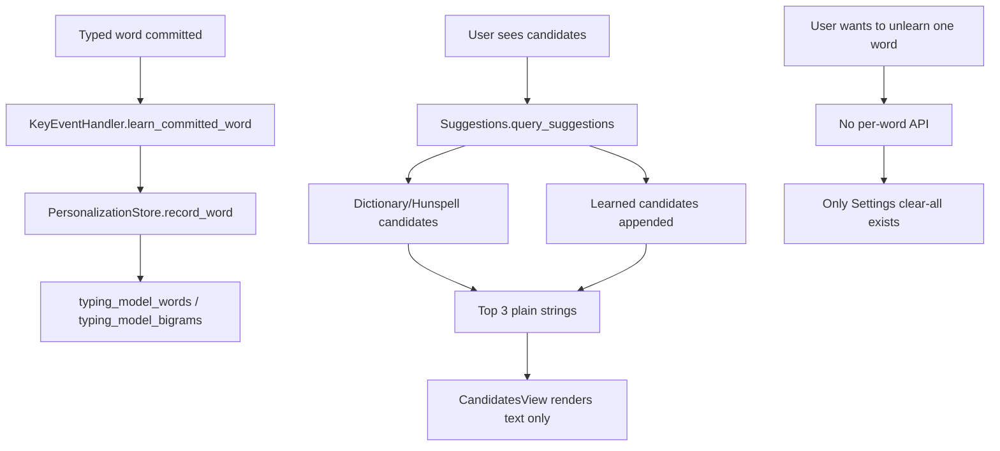

# FrankenKey learned suggestions and unlearn changelog

Date: 2026-07-07
Worktree: `../FrankenKey-autobuild-autocorrect`
Package: `dev.frankenkey.keyboard`

## Summary

This change fixes the learned-suggestions lifecycle and visibility problems reported during the debug-deep investigation:

1. Learned words can now be unlearned one at a time.
2. Learned next-word pairs tied to an unlearned word are removed.
3. Suggestion candidates now show their source, so dictionary, spellcheck, learned, next-word, and emoji candidates no longer look identical.
4. The candidate row now supports Fleksy-like candidate gestures:
   - tap candidate: commit it,
   - swipe down on candidate: commit it,
   - swipe up on candidate: learn or unlearn it without committing text.

The release APK was rebuilt and copied to the standard installable artifact path.

## User-visible behavior

### Before

- Suggestions were displayed as plain text only.
- Learned suggestions looked the same as dictionary/Hunspell/emoji suggestions.
- A learned word could be cleared only by deleting all local typing-assistance data.
- There was no per-word unlearn path.
- Tapping a candidate committed it and also flowed through the normal learning path.

### After

- Candidates display compact source labels:
  - `word · spell` for Hunspell spellcheck suggestions,
  - `word · dict` for bundled dictionary suggestions,
  - `word · learned` for locally learned words,
  - `word · next` for next-word predictions,
  - `emoji · emoji` for emoji suggestions.
- Swipe up on a visible candidate toggles its learned state:
  - if already learned, it is unlearned;
  - if not learned, it is added to the local learned model.
- Swipe down on a visible candidate commits it.
- Tapping a candidate still commits it, preserving existing behavior.

## Fleksy reference evidence

The provided Fleksy APK was inspected read-only at:

```text
/Volumes/TheHoneyBadger/***DOWNLOADS/fleksy-keyboard-11-0-0.apk
```

Extracted resource strings showed these relevant Fleksy behaviors:

- `autoLearnWords`: `Auto-learn words`
- `dictionaryBtn`: `ADD TO DICTIONARY`
- `removedWord`: `Removed Word`
- `settings_dictionnary_suggestions`: `Cycle through word suggestions`
- `swipeDownTutor`: `Swipe down to pick this word`

These establish that Fleksy has per-word add/remove dictionary behavior and swipe-based suggestion selection.

Important implementation decision: FrankenKey already uses keyboard-wide up-swipes for key side-label/gesture input. To avoid breaking existing keyboard gestures, the new learn/unlearn gesture is attached to the candidate row, where it is explicit and does not conflict with side-key swipes.

## Debug-deep root cause

### Proven flow before the fix



### Breakpoints identified

1. `PersonalizationStore` had `record_word`, `suggest_words`, `suggest_next_words`, and `clear`, but no `unlearn_word` or `is_learned`.
2. `SettingsActivity` could only clear all typing-assistance data.
3. `Suggestions` returned plain `String[]` candidates, so the UI could not tell whether a candidate came from the dictionary, Hunspell, learned words, next-word predictions, or emoji.
4. `CandidatesView` rendered candidate text only and only supported tap-to-commit.
5. Learned candidates were appended after dictionary/Hunspell candidates and truncated to the visible top 3, so visible output often looked unchanged even when learned suggestions existed.

## Files changed

### Production code

- `srcs/juloo.keyboard2/suggestions/PersonalizationStore.java`
- `srcs/juloo.keyboard2/suggestions/Suggestions.java`
- `srcs/juloo.keyboard2/suggestions/CandidatesView.java`
- `srcs/juloo.keyboard2/Config.java`
- `srcs/juloo.keyboard2/KeyEventHandler.java`

### Tests

- `test/juloo.keyboard2/suggestions/SuggestionPersonalizationTest.java`

## Production changes

### `PersonalizationStore.java`

Added per-word lifecycle methods:

- `is_learned(String word)`
- `unlearn_word(String word)`

`unlearn_word` now:

1. normalizes the selected word,
2. removes the word from learned word counts,
3. removes any learned bigrams containing that word,
4. clears `_last_word` if it was the removed word,
5. saves the updated typing model.

### `Suggestions.java`

Added source metadata for visible candidates.

New source enum:

```java
public static enum Source
{
  NONE,
  HUNSPELL,
  DICTIONARY,
  LEARNED,
  NEXT_WORD,
  EMOJI
}
```

Added parallel source array:

```java
public Source[] sources = new Source[MAX_COUNT];
```

Source assignment now happens while candidates are collected:

- Hunspell candidates get `Source.HUNSPELL`.
- Bundled dictionary candidates get `Source.DICTIONARY`.
- Learned prefix matches get `Source.LEARNED`.
- Next-word predictions get `Source.NEXT_WORD`.
- Emoji candidate is handled in `CandidatesView` as `Source.EMOJI`.

The source metadata survives candidate reranking by mapping source data by case-insensitive candidate key.

### `CandidatesView.java`

Added:

- `_sources[]` alongside `_items[]`.
- Visible source labels via `label_for` and `source_label`.
- Candidate swipe handling.

Candidate row behavior:

- tap: `suggestion_entered(text)`;
- swipe down: `suggestion_entered(text)`;
- swipe up: `suggestion_swiped_up(text)`.

The swipe threshold is `24dp`.

### `Config.java`

Extended `Config.IKeyEventHandler` with:

```java
public void suggestion_swiped_up(String text);
```

### `KeyEventHandler.java`

Added:

```java
public void suggestion_swiped_up(String text)
```

Behavior:

1. exits if suggestions are disabled or typing assistance is unsafe for the editor;
2. if the word is already learned, unlearns it;
3. otherwise records it as learned;
4. refreshes visible suggestions using the current typed word.

## Function inventory

### Learning lifecycle

- `KeyEventHandler.handle_word_separator`
- `KeyEventHandler.commit_correction`
- `KeyEventHandler.learn_committed_word`
- `KeyEventHandler.suggestion_swiped_up`
- `PersonalizationStore.record_word`
- `PersonalizationStore.is_learned`
- `PersonalizationStore.unlearn_word`
- `PersonalizationStore.suggest_words`
- `PersonalizationStore.suggest_next_words`
- `PersonalizationStore.clear`

### Suggestion display lifecycle

- `Suggestions.started`
- `Suggestions.currently_typed_word`
- `Suggestions.query_suggestions`
- `Suggestions.query_next_words`
- `Suggestions.add_hunspell_candidates`
- `Suggestions.add_candidate`
- `Keyboard2.Receiver.set_suggestions`
- `CandidatesView.set_candidates`
- `CandidatesView.setup_item_view`

### Gesture and candidate dispatch

- `CandidatesView` candidate click listener
- `CandidatesView` candidate touch listener
- `Config.IKeyEventHandler.suggestion_swiped_up`
- `KeyEventHandler.suggestion_swiped_up`

## Tests added

Added to `test/juloo.keyboard2/suggestions/SuggestionPersonalizationTest.java`:

1. `unlearned_word_is_removed_from_prefix_suggestions_without_forgetting_unrelated_words`
   - verifies that unlearning one learned word removes it from persisted learned-word membership and prefix suggestions while preserving another learned word with the same prefix.
2. `unlearning_word_removes_next_word_predictions_that_contain_it`
   - verifies that unlearning a word removes persisted bigrams containing that word so it no longer appears as a next-word prediction, while unrelated next-word predictions remain.
3. `visible_suggestions_mark_learned_candidates_with_learned_source`
   - verifies that a surfaced learned prefix candidate carries `Suggestions.Source.LEARNED` metadata for `CandidatesView`.

The Tester agent also replaced a source-text-grep assertion with behavior-level source metadata coverage, because source-grep tests assert implementation text rather than observable behavior.

## Verification

### Focused personalization tests

Command:

```bash
JAVA_HOME=/opt/homebrew/opt/openjdk@17 \
ANDROID_HOME=/Volumes/TheHoneyBadger/AndroidTooling/android-sdk \
./gradlew testDebugUnitTest --tests juloo.keyboard2.suggestions.SuggestionPersonalizationTest
```

Result:

```text
BUILD SUCCESSFUL
```

Tester-observed test report:

```text
../FrankenKey-autobuild-autocorrect/build/test-results/testDebugUnitTest/TEST-juloo.keyboard2.suggestions.SuggestionPersonalizationTest.xml
```

Result summary:

```text
11 tests, 0 failures, 0 errors, 0 skipped
```

### Focused handler learning tests

Command:

```bash
JAVA_HOME=/opt/homebrew/opt/openjdk@17 \
ANDROID_HOME=/Volumes/TheHoneyBadger/AndroidTooling/android-sdk \
./gradlew testDebugUnitTest --tests juloo.keyboard2.KeyEventHandlerLearningContractTest
```

Result:

```text
BUILD SUCCESSFUL
```

### Release build

Command was run with Java 17, Android SDK, and the existing FrankenKey release signing environment:

```bash
./gradlew assembleRelease
```

Result:

```text
BUILD SUCCESSFUL
```

Observed non-fatal NDK messages during release build:

```text
C/C++: fcntl(): Bad file descriptor
```

The release build completed successfully despite those warnings.

## APK artifact

Release output:

```text
../FrankenKey-autobuild-autocorrect/build/outputs/apk/release/FrankenKey-release.apk
```

Copied installable artifact:

```text
../FrankenKey-autobuild-autocorrect/FrankenKey-installable-release.apk
```

APK metadata:

```text
Package: dev.frankenkey.keyboard
versionName: 2.0.8
versionCode: 59
Size: 5,923,926 bytes
SHA-256: 67a75b30b20e2a00376f47354885d5a66a2a8ebf168c4e546972a1fb19cb1e95
```

Signer:

```text
CN=FrankenKey Release, OU=FrankenKey, O=Local, C=AU
```

Signer certificate SHA-256:

```text
9fdb36334eb40c87d174a2dca1f5efa26e7e7cf52b0f63aac2ac1d507d4376d9
```

## Notes for future work

- The new learn/unlearn gesture intentionally lives on the candidate row, not on global keyboard up-swipe, because FrankenKey already uses keyboard-wide swipe directions for side-key gestures.
- If future work aims to exactly mirror Fleksy’s full keyboard-wide gesture model, it should first design a conflict-free gesture priority model between:
  - key side-label swipes,
  - candidate selection gestures,
  - swipe-left delete-word behavior,
  - swipe-right space behavior.
- Do not add a global up-swipe shortcut without preserving existing side-key input behavior.
