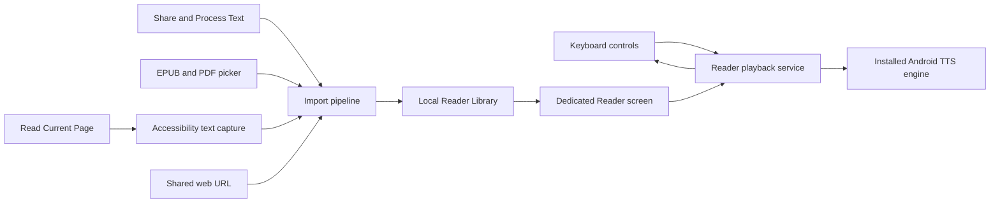

# FrankenKey Reader and Library

**Status:** Draft for product approval  
**Date:** 2026-07-30  
**Product:** FrankenKey for Android

## PRD

### 1. Product goal

Build a private, local-first reading system into FrankenKey that turns clipboard text, shared articles, EPUB books, text-based PDFs, selected text, and accessible page text into spoken audio.

The finished product has two connected surfaces:

1. A keyboard Reader control for starting and controlling speech without leaving the current task.
2. A dedicated FrankenKey Reader and Library screen where imported material is displayed, spoken text is highlighted, reading progress is saved, and previous items can be resumed.

The work is delivered in three cumulative releases:

- **Release 1: Clipboard Reader and speech foundation**
- **Release 2: Reader Library, sharing, EPUB, and text-based PDF**
- **Release 3: Read Current Page through an opt-in accessibility service**

### 2. Success definition

The three-release goal is complete when a user can:

- Tap FrankenKey and read clipboard text aloud.
- Choose among compatible free voices installed on the device.
- Prefer offline voices and optionally enable system voices that require internet access.
- Pause, resume, stop, move between reading units, and change speed.
- Open the dedicated Reader while speech continues.
- Share selected text or a web URL to FrankenKey Reader.
- Import supported EPUB and PDF files.
- Find every imported item in a local Library and resume from its saved position.
- Trigger Read Current Page, review the captured accessible text in the Reader, and listen there.
- Use all core features without creating an account, buying a subscription, or sending Library content to a FrankenKey server.

### 3. Product principles

- **Private by default:** Reader data, document text, progress, and preferences stay on the device.
- **Explicit access:** FrankenKey reads clipboard or screen content only after a user action.
- **Local-first voices:** Offline-capable installed voices are the default. Network-required system voices are hidden until the user enables them.
- **One Reader:** Clipboard text, shared content, books, documents, and captured pages use the same player and Library.
- **Honest format support:** Text-based PDFs are supported. Scanned or image-only PDFs are not described as readable until OCR exists.
- **Recoverable playback:** Speech state and position survive keyboard dismissal, Reader closure, and normal process recreation.
- **No hidden capture:** The accessibility service does nothing between explicit Read Current Page requests.

### Discovery defaults and assumptions

The PRD uses the following defaults so implementation planning does not require repeated discovery questions:

- **Concept:** Add spoken reading and a saved Reader Library to the existing FrankenKey Android keyboard and companion app.
- **Audience:** Existing FrankenKey users and Android users who benefit from listening to articles, books, documents, messages, and notes.
- **Platform:** Native Android only. No web, desktop, or iOS client is planned.
- **Experience:** Keep quick controls in the keyboard and move full reading, highlighting, imports, progress, and Library management into a dedicated app screen.
- **Storage:** Keep metadata, extracted text, progress, preferences, and retained files in app-private local storage.
- **Accounts and security:** Add no login, cloud account, advertising, analytics, or remote FrankenKey content service.
- **Integrations:** Use Android system TTS, Android sharing and file APIs, an opt-in Accessibility Service, and source-reviewed EPUB/PDF components that pass isolated proofs.
- **Scale:** Optimize for one user's on-device Library, long books, and large documents with streamed or paged processing and bounded memory. Server scaling is out of scope.
- **Costs:** Require no paid API, membership, hosting plan, or subscription. Optional network-backed voices are supplied by the user's installed system TTS engine.
- **Design inputs:** No separate wireframe was supplied. The implementation will follow FrankenKey's existing visual system and the interaction model defined in this PRD.
- **Orchestration:** Use the Android source checkout at `/Users/apple/Documents/UNCLUTTER-NEW/CLAUDE-DEV/FrankenKey-autobuild-autocorrect` on the Mac mini. Build work must be resumable, proof-driven, and autonomous except for genuine access, installation, and publication blockers.
- **Signoff:** Each release needs focused automated checks, real-device behavior evidence, signed release identity verification, canonical APK replacement, and mandatory phone upload verification. Installation and publication retain their existing approval gates.

The default Release 3 behavior is user-triggered page capture. It is not continuous focus narration. OCR and scanned-document reading remain out of scope until separately requested.

## Implementation Contract

- App type/platform: native Android input method editor plus companion Reader and Library activities and services, retaining package `dev.frankenkey.keyboard`.
- Allowed tech: the existing FrankenKey Java/XML/Gradle Android stack and its existing Kotlin support, Android platform TTS/share/file/media/accessibility APIs, and source-reviewed Readium and PdfBox-Android integrations only after their required proofs pass.
- Forbidden tech: paid cloud voice APIs, a FrankenKey reading server, advertising or tracking SDKs, non-Android clients, DRM circumvention, OCR in these three releases, debug APK delivery, and replacement of existing keyboard architecture without a proven need.
- Persistence/storage: use the source checkout's established local persistence conventions and app-private files for Library metadata, extracted text, progress, preferences, and retained imports; add no account or cloud synchronization.
- Build/package target: a signed release APK for package `dev.frankenkey.keyboard` that passes `verifyReleaseIdentity` and replaces `/Users/apple/Documents/UNCLUTTER-NEW/CLAUDE-DEV/FrankenKey/FrankenKey-installable-release.apk` only after release-candidate verification.
- Real-world verification: exercise clipboard, Reader, Library, EPUB, text-PDF, sharing, background playback, and opt-in page capture on Android; run focused automated checks and the signed release identity gate; verify package, version, signer, size, and SHA-256; then upload the exact canonical APK to `/storage/emulated/0/Download/FrankenKey-installable-release.apk` and compare its remote size and SHA-256 without installing unless the user separately approves installation.

### Product architecture

### 4. Target audience

Primary users are Android users who want articles, messages, notes, books, and documents read aloud while walking, working, resting their eyes, or dealing with reading and vision difficulties.

The initial design optimizes for one-device use and the existing FrankenKey audience. There is no account, family sharing, team workspace, or cross-device synchronization.

### 5. Scope

#### Included across the three releases

- Android system text-to-speech.
- Voice, language, speed, and pitch selection.
- Offline voice preference and optional network-required system voices.
- Clipboard reading.
- Selected text and current editable-field reading when the host app exposes that text to the keyboard.
- Dedicated Reader screen.
- Background playback with system media controls.
- Spoken sentence or word-range highlighting when the engine supplies range events.
- Local Library with saved progress.
- Android Share and Process Text entry points.
- Shared web URL import and on-device readable-article extraction.
- EPUB 2 and EPUB 3 without digital rights management.
- Unencrypted PDFs with an extractable text layer.
- User-triggered capture of visible text exposed through Android accessibility APIs.
- Delete-one and delete-all controls for local Reader data.

#### Explicitly out of scope for these releases

- A continuously speaking screen reader that announces every focused control.
- OCR for scanned PDFs, screenshots, photographs, or text rendered only as pixels.
- Circumvention of document encryption or digital rights management.
- Paid cloud voice APIs.
- FrankenKey accounts, cloud Library storage, or cross-device sync.
- Reading content from password fields, secure windows, or apps that do not expose text.
- Guaranteed extraction from games, canvas interfaces, videos, protected viewers, or custom controls with no accessible text.
- Publication to GitHub or installation on the test phone without the user approvals already required by the FrankenKey release contract.

### 6. Main user experience

#### 6.1 Keyboard Reader control

Add a Reader button to the keyboard tool area without displacing existing primary typing controls.

A tap opens a source menu appropriate to the current state:

- Read Clipboard
- Read Selected Text
- Read Current Field
- Open Reader
- Read Current Page, available in Release 3 when the accessibility service is enabled

While audio is active, the keyboard shows a compact transport strip:

- Play or resume
- Pause
- Previous reading unit
- Next reading unit
- Stop
- Current item title
- Open full Reader

The keyboard must not start speech merely because clipboard content changed.

#### 6.2 Dedicated Reader

The Reader displays:

- Item title and source type
- Scrollable readable text or publication view
- Highlight for the current spoken unit
- Current chapter or page where available
- Progress indicator
- Play or pause
- Previous and next sentence or paragraph
- Speed control
- Voice control
- Sleep timer as a later enhancement, not a release blocker
- Return to Library

Opening or closing the keyboard must not restart the item or lose position.

#### 6.3 Library

The Library displays locally saved items ordered by most recently opened. Each row shows:

- Title
- Source type
- Import date
- Last-opened date
- Reading progress
- Finished state

Required Library actions:

- Open and resume
- Rename title
- Mark finished or unread
- Delete item and its private cached files
- Delete all Reader data after confirmation

All accepted clipboard, share, URL, EPUB, PDF, and screen-capture imports are saved automatically. A setting can change clipboard Quick Read to temporary mode for users who do not want every clip retained.

#### 6.4 Import entry points

- Keyboard clipboard action
- Android Share target for text and URLs
- Android Process Text target for selected text
- Open EPUB or PDF from the system document picker
- Open-with handling for supported file types
- Read Current Page action from the keyboard or Android accessibility shortcut

### 7. Content behavior

#### 7.1 Plain text and clipboard

- Preserve paragraph boundaries.
- Normalize repeated whitespace without changing meaningful punctuation.
- Split long input into language-aware spoken units below the active TTS engine limit.
- Save position at a stable unit and character offset.
- Reject empty, binary, or unsupported clipboard items with a clear message.
- Do not speak clipboard content marked sensitive.

#### 7.2 Shared web pages

When another app shares text, import that text directly.

When it shares only an HTTP or HTTPS URL:

1. Fetch the page directly from the device.
2. Enforce response size, redirect, timeout, and content-type limits.
3. Extract the readable title and article body on the device.
4. Show a preview before playback when extraction confidence is low.
5. Save the normalized result and original URL in the Library.
6. If extraction fails, explain the failure and offer Read Current Page when available.

No page text is sent to FrankenKey infrastructure.

#### 7.3 EPUB

Use the Readium Kotlin Toolkit as the first candidate because it supports EPUB publication handling, Android TTS, language-aware voices, playback location, and spoken-text decoration. The dependency is BSD 3-Clause licensed.

Required behavior:

- Import EPUB 2 and EPUB 3 without digital rights management.
- Read title, author, language, table of contents, and spine order.
- Start from a selected chapter or saved locator.
- Follow publication language changes where supported.
- Highlight and advance the visual reading position with speech.
- Save the source file in app-private storage so the Library item remains available.
- Report malformed, encrypted, and unsupported EPUB files without crashing.

A programmatic proof must confirm the exact Readium version against FrankenKey's Android API level, build system, APK size, background playback, and representative EPUB fixtures before production integration.

#### 7.4 PDF

PDF support is split into two classes.

**Supported now: text-based PDF**

- The PDF contains an extractable text layer.
- Extract text by page in the background.
- Preserve page boundaries and save page plus text offset.
- Read and resume through the common Reader player.
- Report password-protected or unsupported files clearly.

**Not supported in these releases: scanned or image-only PDF**

- Detect pages that produce no meaningful text.
- Label the item as requiring OCR.
- Do not claim that an empty extraction succeeded.
- Keep OCR as a separately approved, opt-in feature because it adds model size, processing cost, accuracy concerns, and new privacy disclosures.

PdfBox-Android is the first extraction candidate. It supplies `PDFTextStripper`, uses the Apache 2.0 license, requires Android API 19 or later for full functionality, and its public repository is active. Readium's PDF adapter may be evaluated for visual display, but its documented PDF path does not by itself prove text-to-speech extraction.

A programmatic proof must pass before PDF acceptance criteria are committed to production. The proof uses at least:

- A one-page text PDF
- A multi-page book-style PDF
- A multi-column PDF
- A right-to-left or mixed-language PDF
- A password-protected PDF
- An image-only scanned PDF
- A malformed PDF
- A large PDF selected to test bounded memory and cancellation

#### 7.5 Read Current Page

Release 3 adds an opt-in Android Accessibility Service. It is user-triggered, not continuous.

On request, the service:

1. Identifies the active external app window.
2. Traverses visible accessibility nodes.
3. Collects text and content descriptions in stable reading order.
4. Excludes password nodes, FrankenKey's own controls, duplicate text, hidden nodes, and empty labels.
5. Captures a source title from the window or app label when available.
6. Opens a preview in FrankenKey Reader.
7. Saves the accepted capture to the Library and starts playback.

If no useful text is exposed, FrankenKey explains that the page cannot be read and offers Share to FrankenKey Reader as the preferred fallback.

The service does not automatically scroll through apps, click controls, monitor page changes, record keystrokes, or retain accessibility events between explicit capture requests.

### 8. Voice and playback requirements

FrankenKey uses Android's `TextToSpeech` API or the compatible Readium Android TTS layer.

#### Voice picker

- Group voices by language.
- Show a human-readable language and region.
- Mark offline-capable and network-required voices.
- Hide network-required voices until the user enables **Allow online system voices**.
- Preview a voice before selection.
- Offer the system voice-data installation screen when required data is missing.
- Fall back to a compatible installed voice when the saved voice disappears.

#### Playback

- Request and release audio focus correctly.
- Pause or duck for other audio according to Android media conventions.
- Handle headset disconnects and interruptions without losing progress.
- Use a media playback foreground service for long reading sessions.
- Provide notification controls for play, pause, previous, next, and stop.
- Save progress after each completed unit and during lifecycle changes.
- Avoid loading an entire large book or document into memory.
- Continue from the nearest stable sentence or paragraph after process recreation.

### 9. Conceptual data model

Use the source checkout's existing persistence conventions after the source audit. The conceptual records are:

#### `ReaderItem`

- `id`: stable unique identifier
- `title`: user-visible title
- `sourceType`: clipboard, selected text, shared text, URL, EPUB, PDF, or screen capture
- `sourceUri`: original URL or private file reference when applicable
- `mimeType`: detected content type
- `author`: optional publication author
- `languageTag`: optional BCP 47 language
- `createdAt`: import timestamp
- `updatedAt`: content update timestamp
- `lastOpenedAt`: playback or Reader open timestamp
- `progressLocator`: source-specific chapter, page, unit, and character offset
- `progressFraction`: normalized zero-to-one progress
- `finished`: completion state
- `contentHash`: duplicate and cache identity
- `importState`: importing, ready, failed, or OCR required
- `errorMessage`: user-safe failure detail

#### `ReaderContentUnit`

- `itemId`: owning item
- `ordinal`: stable reading order
- `kind`: title, heading, paragraph, list item, quote, page break, or other supported role
- `text`: normalized spoken text
- `languageTag`: optional language override
- `sourceLocator`: EPUB locator, PDF page and range, or plain-text range

#### `ReaderPreferences`

- `voiceByLanguage`: selected voice identifier per language
- `speechRate`: persisted rate
- `pitch`: persisted pitch
- `allowNetworkVoices`: default false
- `saveClipboardReads`: default true
- `defaultSkipUnit`: sentence or paragraph

Files, extracted text caches, and database rows are stored in app-private storage. Deleting a Library item deletes its owned file and cache after active playback stops.

### 10. Security and privacy requirements

- No authentication is required.
- No Reader analytics, advertising identifiers, or tracking are added.
- No automatic clipboard monitoring is added.
- Sensitive clipboard content and password editor content are excluded.
- Accessibility processing occurs only after a visible user command.
- Accessibility service disclosure states what is read, when it is read, what is stored, and how to disable it.
- URL imports allow only HTTP and HTTPS and apply time, redirect, response-size, and MIME checks.
- Imported files are treated as untrusted input and parsed outside the main UI thread.
- Parser crashes, malformed documents, decompression bombs, oversized content, and cancellation paths receive focused tests.
- Library deletion is local and complete, including cached source files.
- Logs must not contain clipboard text, page text, book text, document text, URLs containing secrets, or accessibility node content.

### 11. Release plan

## Release 1: Clipboard Reader and speech foundation

### Goal

Deliver dependable speech from clipboard and editable text, controlled from FrankenKey and the dedicated Reader.

### Deliverables

1. Android TTS engine initialization and shutdown.
2. Voice discovery, language grouping, preview, offline marker, and optional online-system-voice toggle.
3. Speech-rate and pitch settings.
4. Sentence and paragraph tokenization with engine-size limits.
5. Explicit Read Clipboard command.
6. Read Selected Text and Read Current Field when the host editor permits access.
7. Dedicated Reader screen for the active item.
8. Keyboard compact transport controls.
9. Background media playback service and notification.
10. Progress saving for the active item.
11. Sensitive clipboard and password-field exclusion.
12. Error states for missing TTS engine, missing voice data, empty text, and playback failure.

### Acceptance criteria

- A user can choose an installed voice, preview it, and hear clipboard text with that voice.
- Offline-capable voices work in airplane mode after their data is installed.
- Network-required voices are disabled by default and clearly labelled when enabled.
- A 100,000-character plain-text fixture reads in order without truncation, application-not-responding errors, or unbounded memory growth.
- Pause and resume continue from the saved spoken unit rather than restarting the document.
- Hiding the keyboard does not stop active playback.
- Media notification controls change the same playback session shown in the keyboard and Reader.
- Progress survives normal app process recreation.
- Clipboard content marked sensitive is not spoken or displayed.
- Password fields do not expose Read Current Field or selection content.
- No Reader text appears in diagnostic logs.

## Release 2: Reader Library, sharing, EPUB, and text-based PDF

### Goal

Turn FrankenKey Reader into a reusable local reading library for articles, books, and documents.

### Deliverables

1. Persistent Library and data migration path.
2. Automatic saving for accepted Reader imports.
3. Open, resume, rename, mark finished or unread, delete, and delete-all actions.
4. Android Share target for text and URLs.
5. Android Process Text target.
6. System file picker and open-with support for EPUB and PDF.
7. Direct on-device web article fetch and extraction.
8. EPUB import, metadata, chapter order, visual position, speech, and progress.
9. PDF text-layer detection, background extraction, page boundaries, speech, and progress.
10. OCR-required state for image-only PDFs.
11. Import progress, cancellation, and recoverable errors.
12. Duplicate-content handling based on stable content identity.

### Acceptance criteria

- Shared text opens in Reader, is saved once, and resumes after restart.
- A shared HTTP or HTTPS article URL becomes a readable Library item without sending content to a FrankenKey server.
- A valid non-DRM EPUB opens with correct chapter order, speaks, highlights the active unit, and resumes from the saved locator.
- A valid multi-page text PDF extracts in page order, speaks, and resumes from the saved page and text offset.
- An image-only PDF is labelled **OCR required** and is never presented as an empty successful import.
- Password-protected, malformed, oversized, cancelled, and unsupported imports produce user-safe errors without corrupting the Library.
- Import work stays off the main thread and remains cancellable.
- Deleting an item removes its database records, extracted cache, and private source copy.
- A Library database migration preserves existing items and progress.
- Dependency licenses and notices are included where required.

## Release 3: Read Current Page

### Goal

Let the user capture text visible through Android accessibility APIs, move it into the same Reader and Library, and listen with existing controls.

### Deliverables

1. Optional Accessibility Service with accurate manifest metadata.
2. Plain-language setup, disclosure, enable, disable, and troubleshooting screens.
3. Read Current Page command in the keyboard.
4. Android accessibility shortcut action for use when the keyboard is not visible.
5. Visible-node text extraction, ordering, de-duplication, and password exclusion.
6. Capture preview before saving when the extraction is short or uncertain.
7. Reader and Library handoff using the same content model as other imports.
8. Clear Share-to-Reader fallback when a page exposes insufficient text.
9. Google Play AccessibilityService declaration materials if Play distribution is pursued.
10. Focused compatibility fixtures covering standard native views, browser content, custom views, and unsupported secure content.

### Acceptance criteria

- The accessibility service remains inactive until the user enables it in Android settings.
- Text capture occurs only after Read Current Page or the accessibility shortcut is activated.
- A representative article page produces readable, de-duplicated text in expected visual order.
- The captured item opens in Reader and is saved to the Library with source title and timestamp.
- Password nodes, FrankenKey's own UI, and secure or unavailable content are excluded.
- No accessibility text is retained in logs or event history.
- Pages with no useful accessible text show a clear explanation and Share-to-Reader fallback.
- Disabling the service removes Read Current Page availability without affecting clipboard, EPUB, PDF, or shared-text reading.
- The service does not auto-scroll, auto-click, continuously monitor, or narrate general device focus.

### 12. Technical proof gates

No production implementation begins for a new integration until its smallest real proof passes.

1. **TTS proof:** enumerate voices, identify network requirements, speak chunked text, receive range events, stop, resume, and survive keyboard dismissal.
2. **Playback-service proof:** control one TTS session from keyboard, Reader, and media notification.
3. **EPUB proof:** open representative EPUB 2 and EPUB 3 files, enumerate chapters, speak, highlight, and restore a locator with the chosen Readium version.
4. **PDF proof:** extract representative text PDFs with bounded memory and correctly identify image-only and encrypted fixtures.
5. **URL proof:** fetch and extract representative articles with redirect, timeout, MIME, oversized-response, and malformed-HTML cases.
6. **Accessibility proof:** capture ordered visible text from representative apps without logging or retaining unrelated nodes.
7. **Persistence proof:** migrate a Library schema while preserving source references and progress.

Failed proofs change the implementation plan before production code is added. They are not bypassed with placeholders.

### 13. Verification plan

#### Automated checks

- Tokenization boundaries, punctuation, language changes, and maximum TTS request length.
- Voice filtering and fallback.
- Playback state transitions and progress checkpoints.
- Plain-text normalization.
- URL validation and extraction fixtures.
- EPUB metadata, chapter order, locator restoration, and malformed-file handling.
- PDF text extraction, page order, image-only detection, cancellation, and malformed-file handling.
- Accessibility node ordering, duplicate removal, password exclusion, and own-window exclusion.
- Library create, reopen, rename, finish, delete, delete-all, and migration behavior.

#### Android integration checks

- Keyboard button and compact player.
- Reader activity lifecycle.
- Media notification and audio focus.
- Share, Process Text, open-with, and system document picker entry points.
- Accessibility enable, capture, disable, and fallback flows.
- Rotation, dark theme, font scaling, screen reader labels, and large text.
- Offline playback and optional network-required voice behavior.

#### Release checks for each test candidate

- Build only the signed release variant.
- Run the source checkout's focused tests and release identity gate.
- Confirm package ID, display name, launcher icon, version, signer, file size, and SHA-256.
- Replace the canonical installable APK only after the candidate passes its gates.
- Push the verified APK through Termux SSH to `/storage/emulated/0/Download/FrankenKey-installable-release.apk` and verify remote size and SHA-256 against the canonical local APK.
- Do not install on the phone without explicit user approval.
- Keep candidates local until the user confirms testing and approves publication.
- Publish release metadata, changelogs, README changes, backup manifest changes, GitHub tag, and GitHub Release only after that approval.

### 14. Delivery milestones and dependencies

1. **Source grounding:** locate the Android source checkout, read its DOX chain, map the IME, settings, persistence, media, and release patterns, and record focused verification paths.
2. **Foundation proofs:** TTS, playback service, persistence, and lifecycle.
3. **Release 1 implementation and signed candidate verification.**
4. **Document proofs:** Readium EPUB, PDF extraction, URL extraction, and file persistence.
5. **Release 2 implementation and signed candidate verification.**
6. **Accessibility proof and policy review.**
7. **Release 3 implementation and signed candidate verification.**
8. **Independent regression, UX-purpose, error-path, recursive completion, and adversarial reviews.**
9. **User testing and publication only after explicit approval.**

Each release is independently usable and must not rely on incomplete code from the next release.

### 15. Implementation orchestration intent

After the user approves this PRD with `APPROVE PRD`, the orchestration stage will create the resumable run package, exact dependency graph, proof tasks, implementation tasks, worktree assignments, test fixtures, agent roles, access check, and signoff gates.

The intended implementation lanes are:

- Speech engine, media session, and playback state
- Keyboard and Reader user interface
- Library persistence and migration
- Share, URL, and plain-text import
- EPUB integration
- PDF extraction and document safety
- Accessibility page capture
- Android integration verification and release verification

Agents may work in parallel only after shared interfaces and proof results are fixed. The orchestrator owns integration, source-wide checks, signed APK verification, device upload, and final evidence.

### 16. Source checkout for build orchestration

The active Android source checkout is located on the Mac mini at `/Users/apple/Documents/UNCLUTTER-NEW/CLAUDE-DEV/FrankenKey-autobuild-autocorrect`. Orchestration must run against that checkout, read its `AGENTS.md` hierarchy before source work, and keep the release/delivery repository separate.

No paid service, API key, account, or cloud credential is required by this PRD.

### 17. Final signoff criteria

The full three-release program is signed off only when:

- Every acceptance criterion above has evidence.
- Clipboard, shared text, URL, EPUB, text-based PDF, and accessible-page flows work end to end.
- Image-only PDFs are reported accurately as requiring OCR.
- Playback, progress, Library persistence, deletion, and lifecycle recovery work on a real device.
- Privacy exclusions and accessibility disclosure are verified.
- No high or medium in-scope findings remain from independent reviews.
- The exact signed candidate APK passes identity verification and mandatory phone upload verification.
- User testing is complete.
- Publication occurs only after explicit user approval.

## Sources

- [Android TextToSpeech](https://developer.android.com/reference/android/speech/tts/TextToSpeech)
- [Android InputMethodService](https://developer.android.com/reference/android/inputmethodservice/InputMethodService)
- [Android accessibility service guide](https://developer.android.com/guide/topics/ui/accessibility/service)
- [Android secure clipboard handling](https://developer.android.com/privacy-and-security/risks/secure-clipboard-handling)
- [Google Play AccessibilityService policy](https://support.google.com/googleplay/android-developer/answer/10964491)
- [Readium Kotlin Toolkit 3.2.0](https://readium.org/kotlin-toolkit/3.2.0/)
- [Readium text-to-speech guide](https://readium.org/kotlin-toolkit/3.2.0/guides/tts/)
- [Readium content extraction guide](https://readium.org/kotlin-toolkit/3.2.0/guides/content/)
- [Readium PDF support guide](https://readium.org/kotlin-toolkit/3.2.0/guides/pdf/)
- [PdfBox-Android](https://github.com/TomRoush/PdfBox-Android)

## Approval gate

Review this product definition for missing or incorrect behavior. When it matches the intended product, reply with the exact words:

`APPROVE PRD`

That approval starts implementation orchestration planning. It does not start coding. After the orchestration plan is ready, `START BUILD` will be the separate execution approval.