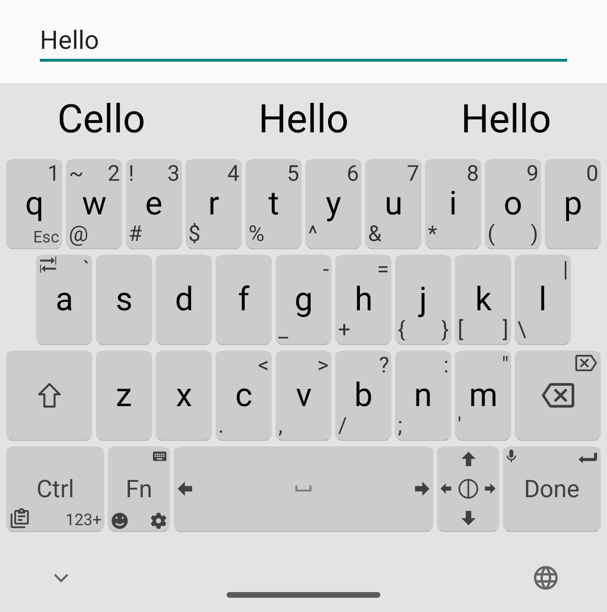
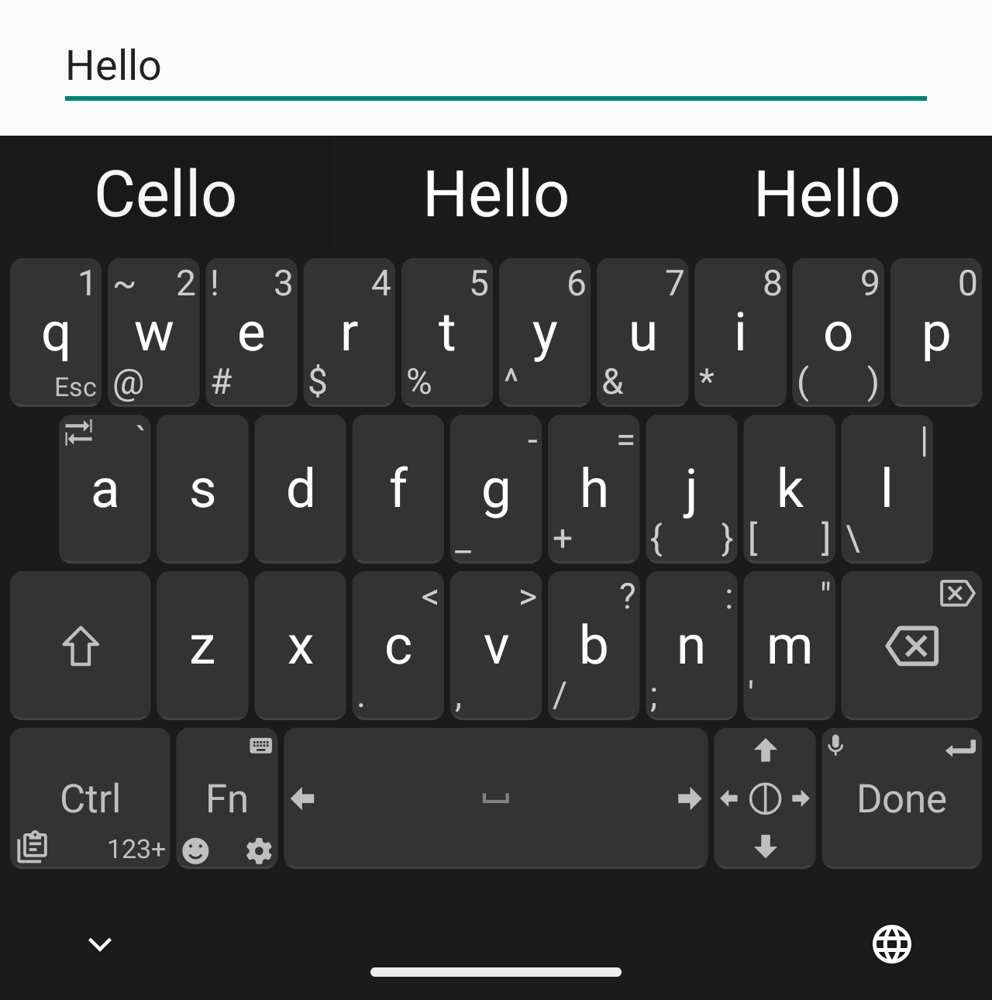
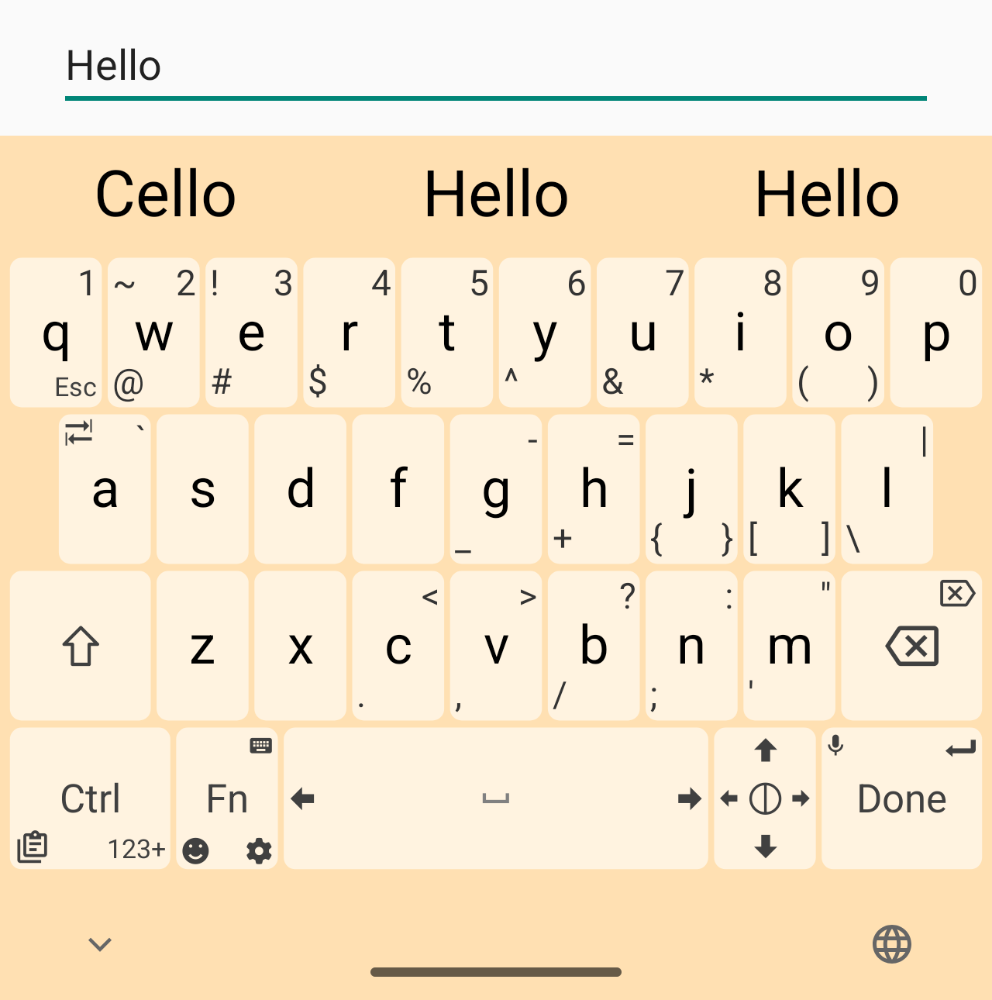
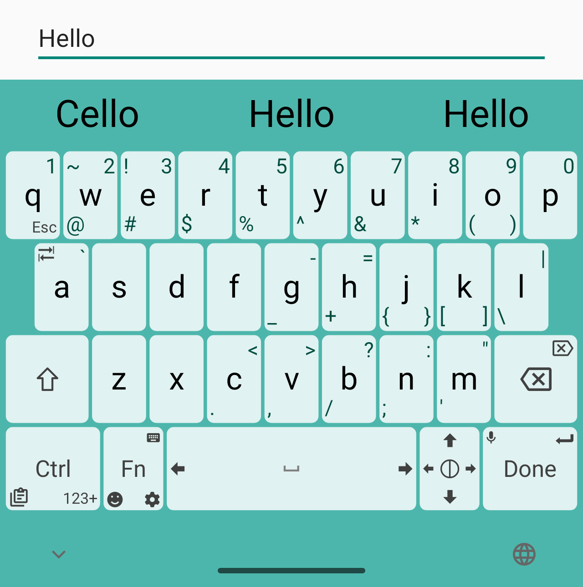
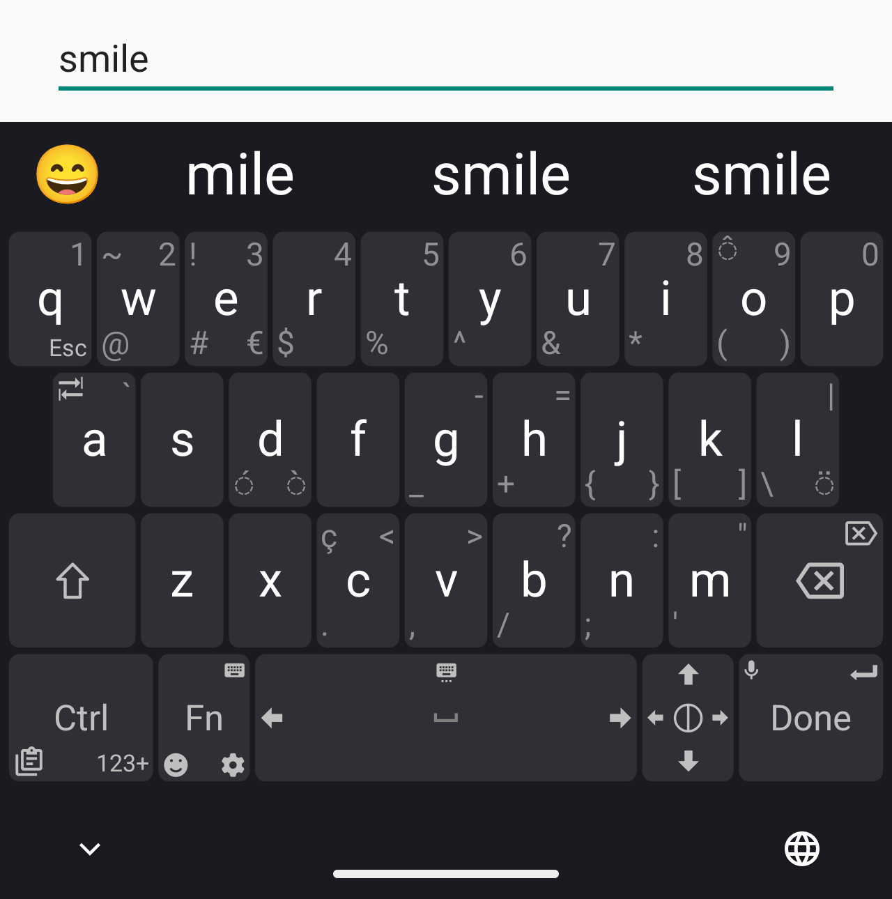
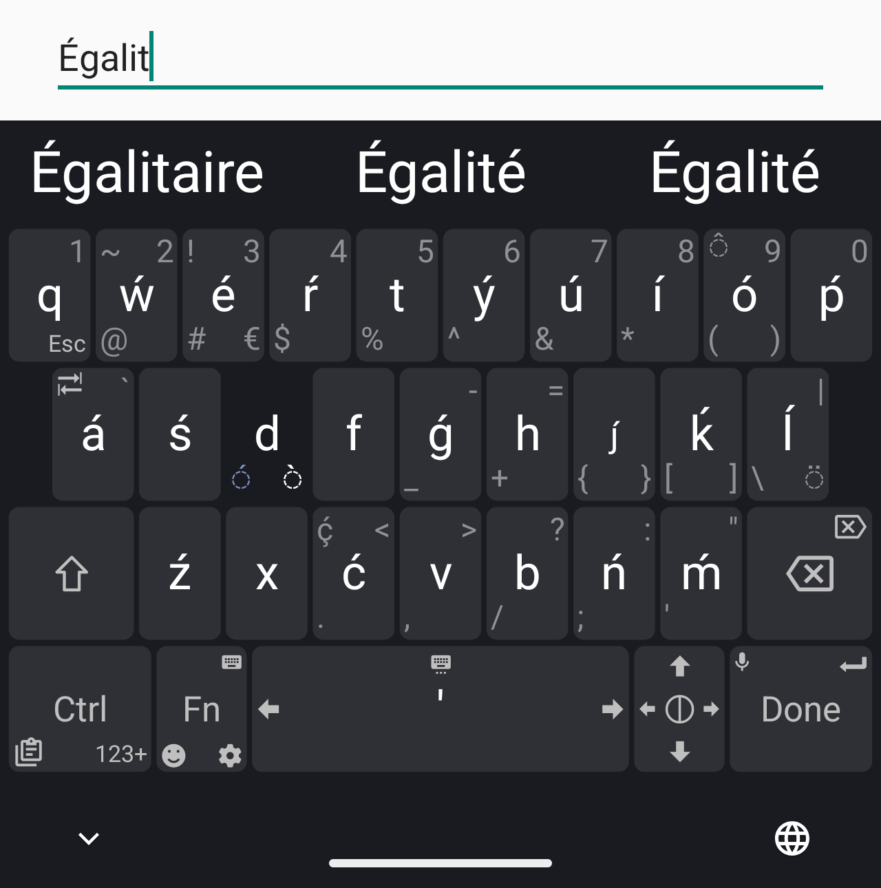

<p align="center">
  
</p>

<h1 align="center">FrankenKey</h1>

<p align="center">
  A keyboard that combines the everyday speed of Fleksy-style typing with the compact power-user controls of Unexpected Keyboard.
</p>

<p align="center">
  <strong>Everyday mode:</strong> clean Fleksy-style typing.<br />
  <strong>FrankenKey mode:</strong> dense coding, terminal, and SSH controls.
</p>

---

## What is FrankenKey?

FrankenKey is an Android keyboard built from the best parts of two very different keyboard ideas:

- **Fleksy-style everyday typing**: a clean keyboard with large letter targets, a simple bottom row, fast access to symbols, and gesture-driven deletion.
- **Unexpected Keyboard-style power use**: a compact keyboard where swipes and corner labels expose coding, shell, and navigation keys without needing a giant layout.

The goal is simple: use a clean keyboard most of the time, then switch to the dense FrankenKey layout when you are coding, using Termux, logging into servers over SSH, editing config files, or working on a computer remotely.

FrankenKey is not affiliated with Fleksy. Fleksy is credited here as the product that inspired the clean everyday typing mode. FrankenKey is based on and gives full credit to [Unexpected Keyboard](https://github.com/Julow/Unexpected-Keyboard), created by Julow and its contributors.

---

## The two keyboard modes

### 1. Everyday Fleksy-style mode

This is the default mode.

Use it when you are writing normal messages, searching, browsing, taking notes, or doing anything where a clean keyboard is faster than a dense programmer layout.

It includes:

- A clean QWERTY layout with minimal visual noise.
- A Fleksy-style bottom row:
  - `123`
  - `Fn`
  - space
  - punctuation
  - enter
- No default `Ctrl` key.
- No default arrow-key cluster.
- Hidden middle-row left-swipe word deletion.
- Bottom-letter editing shortcuts:
  - `z` for select all
  - `x` for cut
  - `c` for copy
  - `v` for paste
- Clean numeric and symbol pages inspired by Fleksy's simple symbol layout.
- Clipboard history for up to 50 recent clips.

This mode is for daily typing first. The advanced controls are still nearby, but they do not crowd the default view.

### 2. FrankenKey mode

This is the optional power-user layout.

Turn this on when you want the compact computer keyboard behavior inherited from Unexpected Keyboard.

It includes:

- Dense corner and swipe labels for symbols.
- Coding punctuation close to the home row.
- `Ctrl`, `Fn`, `Alt`, `Meta`, and related modifier access.
- Arrow keys and navigation controls.
- Terminal-friendly keys such as Tab, Esc, and shell punctuation.
- Compact access to brackets, braces, slashes, quotes, pipes, and operators.
- A `123` button kept from the Fleksy-style layout for quick numeric access.

This mode is for coding, remote desktop work, Termux, SSH, config editing, and situations where every key needs to do more than one thing.

---

## Screenshots

| Everyday setup | Typing | Symbols |
| --- | --- | --- |
|  |  |  |
| Power tools | Settings | Clipboard |
|  |  |  |

---

## Why combine these keyboards?

Most people need two different keyboards:

1. A fast, clean one for normal typing.
2. A compact power keyboard for coding and terminal work.

Fleksy showed how good a phone keyboard can feel when the layout gets out of the way. Unexpected Keyboard showed how much power can fit into a small Android keyboard when swipes and corner labels are used well.

FrankenKey keeps those ideas separate instead of forcing one layout to do everything at once:

- Everyday mode stays clean.
- FrankenKey mode stays dense.
- You choose the mode that matches the job.

---

## Credits

FrankenKey stands on the work of others.

### Unexpected Keyboard

FrankenKey is based on [Unexpected Keyboard](https://github.com/Julow/Unexpected-Keyboard), created by [Julow](https://github.com/Julow) and maintained with contributions from the Unexpected Keyboard community.

Unexpected Keyboard provides the foundation for:

- Android input method behavior.
- Swipe and corner-key architecture.
- Compact programmer-focused layout ideas.
- Open source keyboard infrastructure.

Please see the original project and its history for the upstream work that made FrankenKey possible.

### Fleksy

Fleksy is credited as the inspiration for FrankenKey's clean everyday mode:

- Large, clear letter rows.
- Simple bottom-row structure.
- Fast symbol access.
- Gesture-first typing behavior.

FrankenKey is not affiliated with, endorsed by, or sponsored by Fleksy. The Fleksy references describe design inspiration only.

---

## Privacy

FrankenKey is open source and designed as a local keyboard. The keyboard does not need ads or tracking to work.

Clipboard history is kept for practical typing use. Recent clipboard entries are capped at 50 items.

---

## Build

This repository is an Android project.

Typical local build:

```bash
./gradlew assembleDebug
```

Release builds in this fork have been tested with:

```bash
JAVA_HOME=/opt/homebrew/opt/openjdk@17 ./gradlew assembleRelease
```

If Gradle needs `python`, provide a `python` shim to `python3` before running the build.

---

## License

FrankenKey follows the license terms inherited from Unexpected Keyboard. See [LICENSE](LICENSE).

Because this is a fork, keep upstream attribution intact when redistributing modified versions.
