# Crew plan — Typing Intelligence (one coordinated run)

**Slug:** `crew-plan-typing-intelligence-2026-09-27` · **Plan:** `crew-plan-typing-intelligence-2026-09-27.crew.json`
**Repo:** `/Users/apple/Documents/UNCLUTTER-NEW/CLAUDE-DEV/FrankenKey-autobuild-autocorrect` · **Target:** `autobuild/frankenkey-autocorrect-suggestions` @ `57f1356` (2.0.119 / vc170)
**Queue:** `crew queue-add <repo> <this json> --target autobuild/frankenkey-autocorrect-suggestions` — **no `--promote`** (commits to the source branch need separate operator approval; the run ends verified on the integration branch, and the operator decides the merge/test-build/upload/release steps per root Release Contracts).

## 1. Why one run, not five

The section PRDs (A–E) are the intake documents, but they share hard dependencies (A0 → B3/C3/C4/D2/D4; C1 → D1b/D3; A1 → C3/C4) and one `ti/integration`-style merge order. Queue-level `depends_on` only releases on `done` **and** `promoted`, and promotion merges to the source branch — not authorized. A single run with a lane DAG preserves both the wave model and the approval gates.

Stage-granularity is preserved inside lanes: `a0-seams` is Wave 0 alone; `a-strip`, `b-email`, `c-learn`, `d-power-store`, `e-grammar` are Wave 1+ parallel; `c-strip` waits on `a-strip`+`c-learn` (C3/C4 need tickets); `d-power-gestures` waits on `a-strip`+`c-learn` (D1b/D3 need the undo window).

```mermaid
graph LR
  SEAMS[a0-seams] --> STRIP[a-strip]
  SEAMS --> EMAIL[b-email]
  SEAMS --> LEARN[c-learn]
  SEAMS --> DSTORE[d-power-store]
  STRIP --> CSTRIP[c-strip]
  LEARN --> CSTRIP
  STRIP --> DGEST[d-power-gestures]
  LEARN --> DGEST
  EGRAM[e-grammar]:::ind
  classDef ind fill:#123,stroke:#39f
```

## 2. Section PRDs (intake)

| Doc | Lane binding |
|---|---|
| `PRD-FrankenKey-TI-A-Strip-Reliability-2026-09-27.md` | `a0-seams`, `a-strip` |
| `PRD-FrankenKey-TI-B-Email-Memory-2026-09-27.md` | `b-email` |
| `PRD-FrankenKey-TI-C-Adaptive-Learning-2026-09-27.md` | `c-learn`, `c-strip` |
| `PRD-FrankenKey-TI-D-Power-Typing-2026-09-27.md` | `d-power-store`, `d-power-gestures` |
| `PRD-FrankenKey-TI-E-Grammar-2026-09-27.md` | `e-grammar` |

Canonical specs remain the five lane handoff docs + overview in this folder; the PRDs are the run-facing contracts.

## 3. Recorded decisions adopted at launch

- Q1: no extra switches for D; inline completion follows the Suggestions master switch.
- Q2: C defaults 1–5 ON, 6 OFF.
- Q3: contextual near-vertical down-swipe inside the undo window; space-swipe accept dropped.
- Q4: prose email recall/learning ON (lower weight).
- Q5: `ti_ai_writing_model` defaulting to the Reader AI model.
- Version bump / signed APK / canonical-APK replacement / phone upload / tag / release: **integrator+operator only**, never a lane.
- Delivery-repo DOX (`PRODUCT.md`, root `AGENTS.md`, README, CHANGELOG, fastlane): integrator at release; lanes update only source-repo DOX (`srcs/**/AGENTS.md`, `res/AGENTS.md`, `suggestions/AGENTS.md`, source `PRODUCT.md`, new `grammar/AGENTS.md`).

## 4. Gates

`testDebugUnitTest`, `assembleDebug`, `lintVitalRelease` — all `integration_only` (run at integration/wave exits). Lane verification = lane-executed focused tests + receipts per lane doc exit criteria.

## 5. Evidence

Research: `RESEARCH-typing-intelligence-2026-09-27.md` (this folder). Anchors verified 2026-09-28 @ 57f1356: `srcs/juloo.keyboard2/suggestions/CandidatesView.java:81`, `srcs/juloo.keyboard2/suggestions/SharedDecoder.java:1093`, `srcs/juloo.keyboard2/KeyEventHandler.java:764`, `srcs/juloo.keyboard2/KeyEventHandler.java:2340`, `srcs/juloo.keyboard2/EditorConfig.java:183`, `srcs/juloo.keyboard2/CurrentlyTypedWord.java:455`, `srcs/juloo.keyboard2/Pointers.java:255`, `srcs/juloo.keyboard2/suggestions/Decoder.java:498`, `srcs/juloo.keyboard2/suggestions/PersonalizationStore.java:418`, `srcs/juloo.keyboard2/SettingsBackup.java:92`, `res/xml/bottom_row.xml:6`, `res/xml/clean_text.xml:41`, `srcs/juloo.keyboard2/Keyboard2.java:484`.
